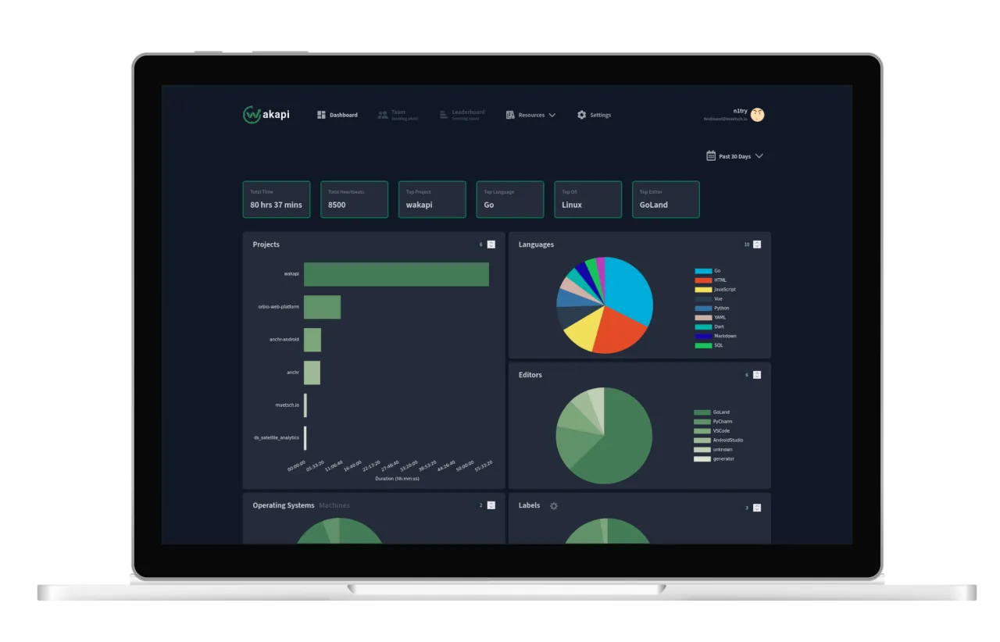

<p align="center">
  
</p>

<p align="center">
  
  
  <a href="https://goreportcard.com/report/github.com/zetkey/waka3x"></a>
</p>

<h3 align="center">Waka3x: A minimalist, self-hosted WakaTime-compatible backend for coding statistics.</h3>

<div align="center">
  <h3>
    <a href="#-features">Features</a>
    <span> | </span>
    <a href="#%EF%B8%8F-how-to-use">How to use</a>
  </h3>
</div>

<p align="center">
  
</p>

> [!IMPORTANT]
> Waka3x is a community fork of Wakapi.

## 🚀 Features

* ✅ Free and open-source
* ✅ Built by developers for developers
* ✅ Modern Vue 3 + Vite SPA frontend with Tailwind CSS & shadcn-vue
* ✅ Statistics for projects, languages, editors, hosts and operating systems
* ✅ Badges
* ✅ Weekly E-Mail reports
* ✅ REST API
* ✅ Partially compatible with WakaTime
* ✅ WakaTime integration
* ✅ Support for Prometheus exports
* ✅ Lightning fast
* ✅ Self-hosted

## ⌨️ How to use?

There are different options for how to use Waka3x, ranging from our hosted cloud service to self-hosting it. Regardless of which option you choose, you will always have to do the [client setup](#-client-setup) in addition.

### 📦 Use Docker

```bash
# Create a persistent volume
$ docker volume create waka3x-data

$ SALT="$(cat /dev/urandom | LC_ALL=C tr -dc 'a-zA-Z0-9' | fold -w ${1:-32} | head -n 1)"

# Run the container
$ docker run -d \
  --init \
  -p 3000:3000 \
  -e "WAKA3X_PASSWORD_SALT=$SALT" \
  -v waka3x-data:/data \
  --name waka3x \
  --restart unless-stopped \
  waka3x:latest
```

**Note:** By default, SQLite is used as a database. To run Waka3x in Docker with MySQL or Postgres, see [Dockerfile](https://github.com/zetkey/waka3x/blob/main/Dockerfile) and [config.default.yml](https://github.com/zetkey/waka3x/blob/main/config.default.yml) for further options.

#### Docker Compose

Alternatively, you can use Docker Compose for an even more straightforward deployment. See [compose.yml](https://github.com/zetkey/waka3x/blob/main/compose.yml) for configuration details.

Waka3x uses [Docker Secrets](https://docs.docker.com/compose/how-tos/use-secrets/) for sensitive variables: `WAKA3X_PASSWORD_SALT`, `WAKA3X_DB_PASSWORD`, `WAKA3X_MAIL_SMTP_PASS`. These are sourced from environment variables defined in a `.env` file.

##### Setup

```bash
# Copy the sample environment file
cp .env.sample .env

# Edit .env and set your secure values
vi .env

# Start the services
docker compose up -d
```

If you prefer to persist data in a local directory while using SQLite as the database, make sure to set the correct `user` option in the Docker Compose configuration to avoid permission issues.

### 🧑‍💻 Compile and run from source

```bash
# Build and install
# Alternatively: go build -o waka3x
$ go install github.com/zetkey/waka3x@latest

# Get default config and customize
$ curl -o waka3x.yml https://raw.githubusercontent.com/zetkey/waka3x/main/config.default.yml
$ vi waka3x.yml

# Run it
$ ./waka3x -config waka3x.yml
```

**Note:** Check the comments in `config.yml` for best practices regarding security configuration and more.

💡 When running Waka3x standalone (without Docker), it is recommended to run it as a [SystemD service](etc/waka3x.service).

### 💻 Client setup

Waka3x relies on the open-source [WakaTime](https://github.com/wakatime/wakatime-cli) client tools. In order to collect statistics for Waka3x, you need to set them up.

1. **Set up WakaTime** for your specific IDE or editor. Please refer to the respective [plugin guide](https://wakatime.com/plugins)
2. **Edit your local `~/.wakatime.cfg`** file as follows:

```ini
[settings]
# Your Waka3x server URL
api_url = http://localhost:3000/api

# Your Waka3x API key
api_key = <your-api-key>
```

#### WakaTime integration
You can use WakaTime and Waka3x in parallel, that is, have your coding activity tracked in both systems. 
This can be configured either on the **client-side (preferred)** on a system-wide- or per-project basis or using Waka3x's **relay** functionality (__Settings → Integrations__) to forward heartbeats to WakaTime.

**Example:**
```ini
[settings]
api_key = defaults-to-this-api-key-when-not-defined-below
[api_urls]
.* = https://your-domain.com/api|waka3x-api-key
.* = https://api.wakatime.com/api/v1|waka-api-key
```

See [wakatime-cli usage](https://github.com/wakatime/wakatime-cli/blob/develop/USAGE.md#api-urls-section) for details.

## 💻 Development

### Frontend
The frontend is a Vue 3 SPA located in the `frontend/` directory, managed via **Bun**.

```bash
$ cd frontend
$ bun install
$ bun dev
```

### Backend
The backend is a Go application.

```bash
$ go run main.go
```

## 📚 Documentation

Currently (the core functionality) it's pretty much the same as Wakapi's documentation. For more detailed information, please refer to the original [Wakapi Wiki](https://github.com/muety/wakapi/wiki).

## 📓 License

MIT @ [Ferdinand Mütsch](https://muetsch.io) (Original Wakapi)

Forked and maintained as Waka3x by [Zetkey](https://github.com/zetkey).
